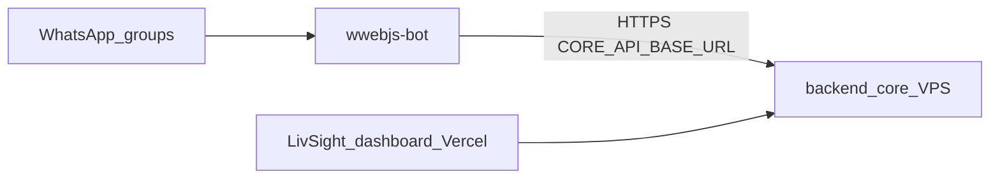

# LivSight WhatsApp Service

Node.js WhatsApp bot (`whatsapp-web.js`) that creates deliveries on **LivSight backend_core** when `USE_CORE_API=true`.

The main LivSight **dashboard** lives in a separate repo (Vercel). Legacy `wwebjs-bot` Express API remains in this repo for optional local/legacy deploy on the bot VPS.

---

## Architecture



**Two VPSes in staging/prod:**

- **Bot VPS** — PM2 `whatsapp-bot-core` (this repo)
- **Core VPS** — `https://livsighttest.didierdjakoua.site` (auth + API)

---

## Quickstart (local)

```bash
cd wwebjs-bot
cp .envexample .env   # edit CORE_* and credentials
npm install
npm run dev          # bot + optional local API
```

See [wwebjs-bot/README.md](wwebjs-bot/README.md) and [wwebjs-bot/docs/DEPLOY_STAGING.md](wwebjs-bot/docs/DEPLOY_STAGING.md).

---

## Docs

- [wwebjs-bot/docs/HOW_THE_BOT_WORKS.md](wwebjs-bot/docs/HOW_THE_BOT_WORKS.md) — **guide équipe** (staff): fonctionnalités, formats, onboarding `#link`
- [WHATSAPP_SERVICE_ROLLOUT.md](WHATSAPP_SERVICE_ROLLOUT.md) — integration roadmap
- [wwebjs-bot/docs/DEPLOY_STAGING.md](wwebjs-bot/docs/DEPLOY_STAGING.md) — staging deploy on bot VPS
- [API.md](API.md) — legacy REST API (optional)
- [Production Deployment guide.md](Production%20Deployment%20guide.md) — legacy full stack

---

## CI/CD

- **CI** — `wwebjs-bot` Jest + Postgres integration (`.github/workflows/ci.yml`)
- **CD** — auto via `ci.yml` (`deploy-bot` after tests on `main`); manual via `cd-bot-core.yml` (see [DEPLOY_STAGING.md](wwebjs-bot/docs/DEPLOY_STAGING.md))
