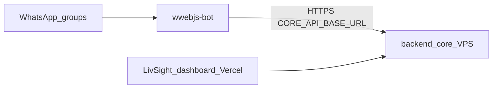

# LivSight WhatsApp Service

Node.js WhatsApp bot ([whatsapp-web.js](https://github.com/pedroslopez/whatsapp-web.js)) that creates orders on **LivSight backend_core** when `USE_CORE_API=true`.

The LivSight **dashboard** is a separate repo (Vercel → core gateway). This repo also keeps an optional **legacy Express API** for older bot-VPS deploys.

---

## Architecture


```mermaid
flowchart LR
  WhatsApp[WhatsApp_groups]
  Bot[wwebjs-bot]
  Core[backend_core_VPS]
  Dashboard[LivSight_dashboard_Vercel]

  WhatsApp --> Bot
  Bot -->|HTTPS CORE_API_BASE_URL| Core
  Dashboard --> Core
```

| Host | Role |
|------|------|
| **Bot VPS** | PM2 `whatsapp-bot-core` at `/opt/livsight-whatsapp-core` (this repo) |
| **Core VPS** | Auth + API (e.g. staging gateway / `livsighttest.didierdjakoua.site`) |
| **Vercel** | Dashboard (`VITE_API_BASE_URL` → core) |

**Core flow:** login as bot user → resolve client by WhatsApp group id → match catalog packages → `POST /api/transactions` (incl. `scheduled_delivery_date`, multi-SKU `items[]` when matched).

---

## Quickstart (local)

```bash
cd wwebjs-bot
cp .envexample .env   # set USE_CORE_API=true, CORE_*, CLIENT_ID
npm install
npm run dev           # bot (src/index.js) via nodemon
npm test              # Jest
```

Legacy API only (optional): `npm run api:dev`.

Details: [wwebjs-bot/README.md](wwebjs-bot/README.md) · staging: [wwebjs-bot/docs/DEPLOY_STAGING.md](wwebjs-bot/docs/DEPLOY_STAGING.md).

---

## Key env (core mode)

| Variable | Purpose |
|----------|---------|
| `USE_CORE_API` | `true` → backend_core (not local `deliveries`) |
| `SKIP_MIGRATIONS` | `true` recommended in core mode |
| `CORE_API_BASE_URL` | Gateway base URL |
| `CORE_BOT_USERNAME` / `CORE_BOT_PASSWORD` | Bot login (`whatsapp-bot`) |
| `CLIENT_ID` | WhatsApp LocalAuth session isolation |
| `SCHEDULED_DELIVERY_CUTOFF_HOUR` | After this hour (Africa/Douala), default delivery date = tomorrow (default `18`) |
| `BOT_HEALTH_PORT` | Local health (default `3099`) |
| `PUPPETEER_EXECUTABLE_PATH` | Optional system Chrome path on VPS |

Full template: [wwebjs-bot/.envexample](wwebjs-bot/.envexample).

---

## Docs

| Doc | Audience |
|-----|----------|
| [wwebjs-bot/devops/](wwebjs-bot/devops/) | **DevOps folder** — watchdog, crontab example, file index |
| [wwebjs-bot/docs/HOW_THE_BOT_WORKS.md](wwebjs-bot/docs/HOW_THE_BOT_WORKS.md) | Staff — formats, `#link`, onboarding |
| [wwebjs-bot/docs/DEPLOY_STAGING.md](wwebjs-bot/docs/DEPLOY_STAGING.md) | Staging bot VPS deploy |
| [wwebjs-bot/docs/OPS_RUNBOOK.md](wwebjs-bot/docs/OPS_RUNBOOK.md) | Ops — health, alerts, reconnect |
| [PRODUCTION_DEPLOYMENT_CHECKLIST.md](PRODUCTION_DEPLOYMENT_CHECKLIST.md) | Prod checklist |
| [WHATSAPP_SERVICE_ROLLOUT.md](WHATSAPP_SERVICE_ROLLOUT.md) | Integration roadmap |
| [API.md](API.md) | Legacy REST API |
| [Production Deployment guide.md](Production%20Deployment%20guide.md) | Legacy full-stack deploy |

---

## CI/CD

- **CI** — Jest + Postgres smoke on `wwebjs-bot/**` (`.github/workflows/ci.yml`)
- **CD** — job `deploy-bot` after tests on push to `main` (SSH → pull → `pm2 restart whatsapp-bot-core`)
- **Manual** — Actions → **CD Bot Core** (`cd-bot-core.yml`, skips CI gate)

On the bot VPS, manage the process as the **deploy** user only (one PM2 instance, one WhatsApp session). Staff DM checks: `#ping`, `#status`.
